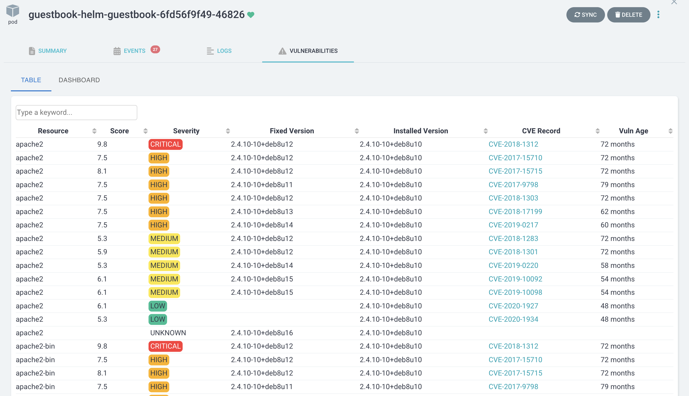
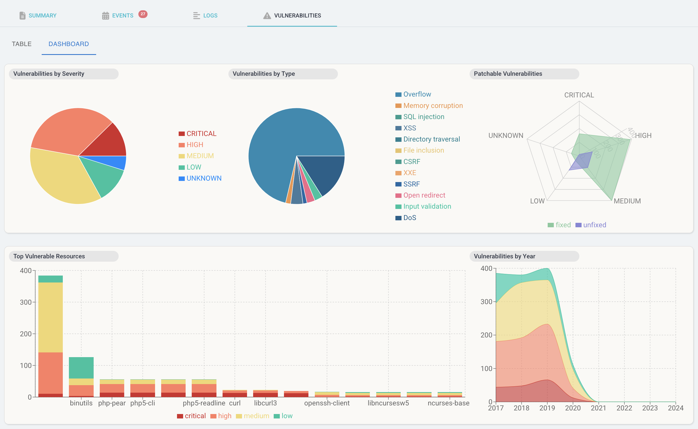

# argocd-trivy-extension

Argo CD UI extension that displays vulnerability report data from [Trivy](https://aquasecurity.github.io/trivy), an open source security scanner.

`Trivy` creates a vulnerability report Kubernetes resource with the results of a security scan. The UI extension then parses the report data and displays it as a grid and dashboard viewable in Pod resources within the Argo CD UI.

 

## Prerequisites

- Argo CD version 2.6+
- [Trivy Operator](https://aquasecurity.github.io/trivy-operator/v0.3.0/operator/)

## Install UI extension

The UI extension needs to be installed by mounting the React component in Argo CD API server. This process can be automated by using the argocd-extension-installer. This installation method will run an init container that will download, extract and place the file in the correct location.

### Helm

Use this values.yaml file to install the extension using Helm:

```yaml
server:
  extensions:
    enabled: true
    extensionList:
      - name: extension-trivy
        env:
          - name: EXTENSION_URL
            value: https://github.com/mziyabo/argocd-trivy-extension/releases/download/v0.1.0/extension-trivy.tar
          - name: EXTENSION_CHECKSUM_URL
            value: https://github.com/mziyabo/argocd-trivy-extension/releases/download/v0.1.0/extension-trivy_checksums.txt
```

### Kustomize

The yaml file below is an example of how to define a kustomize patch to install this UI extension:

```yaml
apiVersion: apps/v1
kind: Deployment
metadata:
  name: argocd-server
spec:
  template:
    spec:
      initContainers:
        - name: extension-trivy
          image: quay.io/argoprojlabs/argocd-extension-installer:v0.0.1
          env:
          - name: EXTENSION_URL
            value: https://github.com/mziyabo/argocd-trivy-extension/releases/download/v0.1.0/extension-trivy.tar
          - name: EXTENSION_CHECKSUM_URL
            value: https://github.com/mziyabo/argocd-trivy-extension/releases/download/v0.1.0/extension-trivy_checksums.txt
          volumeMounts:
            - name: extensions
              mountPath: /tmp/extensions/
          securityContext:
            runAsUser: 1000
            allowPrivilegeEscalation: false
      containers:
        - name: argocd-server
          volumeMounts:
            - name: extensions
              mountPath: /tmp/extensions/
      volumes:
        - name: extensions
          emptyDir: {}
```

### Release Notes

WIP, contributions welcome

### License

Apache-2.0
